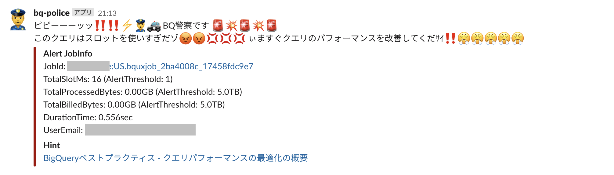

# bq-police

Slack alert functions for Google BigQuery query performance and billing with Cloud Functions.

Sample Slack alert.



## Architecture

```
BigQuery Log(Cloud Logging) --> Cloud PubSub --> Cloud Functions(filter and notify) --> Slack
```

## How to use

### Requirements

- terraform 0.12
- Python 3.7
- google-cloud-sdk
- Slack Webhook URL

### Settings

Set your config and customize message in [`.src/config.py`](.src/config.py)

```python
SLACK_ICON_EMOJI  = ':male-police-officer:'
SLACK_USERNAME    = 'bq-police'
SLACK_CHANNEL     = 'random'
SLOT_ALERT_THRESHOLD           = 600000  # 10min Slots
BILLED_BYTE_ALERT_THRESHOLD    = 5*1000*1000*1000*1000  # 5TB
PROCESSED_BYTE_ALERT_THRESHOLD = 5*1000*1000*1000*1000  # 5TB
SLACK_ALERT_MESSAGE_TEXT = "Query Alert!!"
```

### Deploy

1. Google login.

```bash
gcloud auth application-default login
```

2. terraform plan and apply with your GCP Project ID.

```bash
cd infrastructure/terraform
terraform init
export TF_VAR_project_id=<your GCP Project ID>
export TF_VAR_slack_webhook_url=<your Slack Webhhok URL>
terraform plan
terraform apply
```

### Test

TBD
